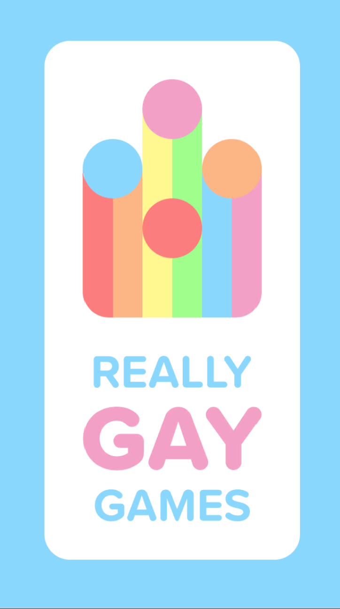
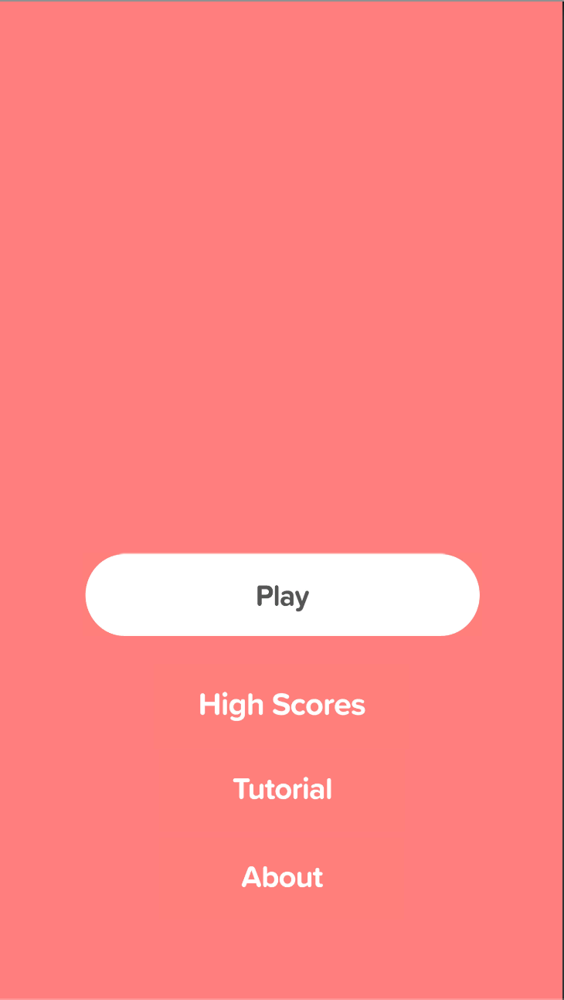

# RGG-tile-game
This is a proof of concept mobile tile game developed for Really Gay Games

### Online video link
[Current Progress Video](https://youtu.be/XllbeB6QHL0)

Really gay games tile game concept. This is a mobile game that was built using Unity. As you can see towards the end the characters will collide. Need a good implementation for the characters to be aware of each other while they are moving. The main character Thistle is part of another game that I was working on with Christian. This is a shaped-based concept game where Thistle needs to boost into the divots of the enemies to kill them.

#### Images of UI

#### Website
[Really Gay Games](reallygay.games)

#### Disclaimer
I do not own any of the artwork, it was created by Christian. 
I worked on all the code and software of Really Gay Games.
